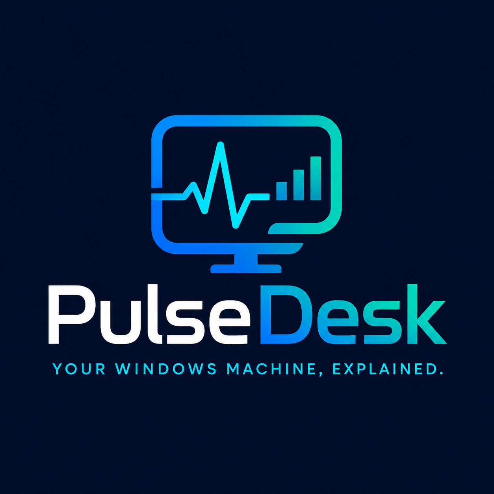
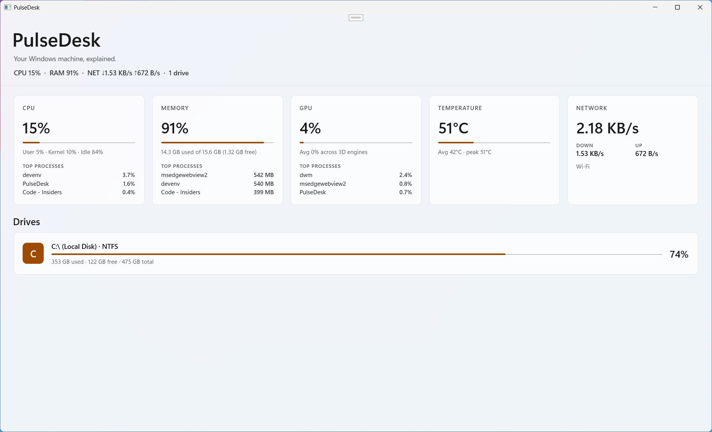

<!-- markdownlint-disable MD033 -->
<div align="center">



# PulseDesk

**Your Windows machine, explained.**

A native, local-first Windows system health dashboard built with WinUI 3 and .NET. PulseDesk gives you a compact live view of CPU, RAM, GPU, network activity, temperatures, drives, and the top processes behind the load.

[Overview](#overview) • [Features](#features) • [Getting Started](#getting-started) • [Project Structure](#project-structure) • [Troubleshooting](#troubleshooting)

</div>

## Screenshot

<div align="center">



</div>

## Overview

PulseDesk is designed for the moment your PC feels slow and Task Manager does not give you the full picture fast enough. It keeps the experience focused: a single desktop window, live metrics, and short summaries that help you understand what the machine is doing right now.

> [!IMPORTANT]
> PulseDesk is currently a Windows-only desktop app. The active project targets WinUI 3 on .NET 8 and uses Windows performance counters and system APIs that are not available cross-platform.

> [!NOTE]
> The app is intentionally local-first and lightweight. It does not require a browser, a cloud service, or background infrastructure.

## Features

- Live CPU usage with user, kernel, and idle breakdown
- Live memory usage with used, free, and total memory details
- Live GPU activity using Windows GPU engine counters
- Top CPU, memory, and GPU processes surfaced inline with each metric
- Network throughput for the active adapter with upload and download rates
- Temperature monitoring when Windows exposes thermal sensors
- Fixed-drive capacity and utilization cards
- Responsive WinUI layout that collapses from 5 columns down to 1 on narrower windows

## Tech Stack

- .NET 10
- WinUI 3 with Windows App SDK
- CommunityToolkit WinUI controls
- Native Windows performance counters and system APIs
- MSIX-ready project configuration with publish profiles for x86, x64, and ARM64

## Getting Started

### Prerequisites

- Windows 10 version 1809 or later
- .NET 10 SDK
- Git

If you want the smoothest editing and packaging experience, Visual Studio 2022 with WinUI and Windows App SDK tooling is a good fit, but the project can also be built and run from the command line.

### Clone the repository

```powershell
git clone https://github.com/kasuken/pulsedesk.git
cd pulsedesk
```

### Restore and build

```powershell
dotnet restore PulseDesk.slnx
dotnet build PulseDesk.slnx
```

### Run the app

```powershell
dotnet run --project .\PulseDesk\PulseDesk.csproj
```

The main app project lives in the PulseDesk folder and opens as a native Windows desktop window.

## What PulseDesk Shows

### CPU

PulseDesk samples total CPU load plus user, kernel, and idle time, then smooths recent samples to reduce jitter. It also lists the top CPU-consuming processes in the current window.

### Memory

Memory shows current load percentage, used memory, available memory, and total physical memory. The memory card also surfaces the top processes by working set.

### GPU

GPU monitoring uses the Windows GPU Engine performance counter category and currently focuses on 3D engine utilization. If available, PulseDesk also shows the top GPU-heavy processes.

### Temperature

Temperature readings come from the Windows Thermal Zone Information counters. On some machines these counters are not exposed, so this card may show as unavailable.

### Network

The network card tracks the active non-loopback, non-tunnel adapter and displays current download and upload throughput.

### Drives

Drive cards summarize fixed local drives, including label, file system, total capacity, free space, and utilization.

## Project Structure

```text
PulseDesk.slnx
assets/
  logo/
PulseDesk/
  App.xaml
  MainWindow.xaml
  MainWindow.xaml.cs
  DriveViewModel.cs
  ProcessRowViewModel.cs
  Services/
    CpuService.cs
    MemoryService.cs
    GpuService.cs
    GpuTopProcessesService.cs
    NetworkService.cs
    TemperatureService.cs
    DriveService.cs
    TopProcessesService.cs
```

## Troubleshooting

> [!TIP]
> Some metrics depend on the counters, drivers, and sensors exposed by the current machine. "Unavailable" usually means the underlying Windows data source is missing or inaccessible, not that PulseDesk itself failed to start.

Common cases:

- The first CPU or GPU reading can briefly show low or zero values while counters warm up.
- GPU metrics may be unavailable on systems where the GPU Engine performance counters are disabled or not exposed.
- Temperature metrics may be unavailable on desktops or laptops that do not publish thermal zone data through Windows.
- Network metrics follow the currently selected active adapter and ignore loopback, tunnel, VPN, and some virtual adapters.

If the app fails to build or run, start with these commands:

```powershell
dotnet restore PulseDesk.slnx
dotnet build PulseDesk.slnx
dotnet run --project .\PulseDesk\PulseDesk.csproj
```

## Current Direction

PulseDesk is currently centered on one job: making Windows system load legible at a glance. The current implementation focuses on live visibility into CPU, RAM, GPU, disk, network, temperatures, and bottleneck clues without turning into a heavyweight monitoring suite.